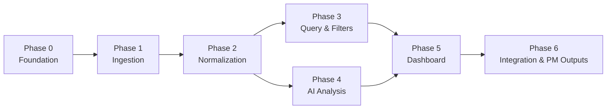
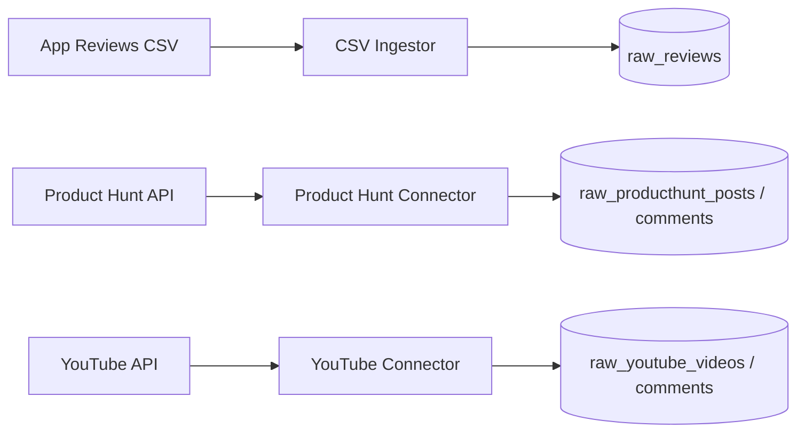
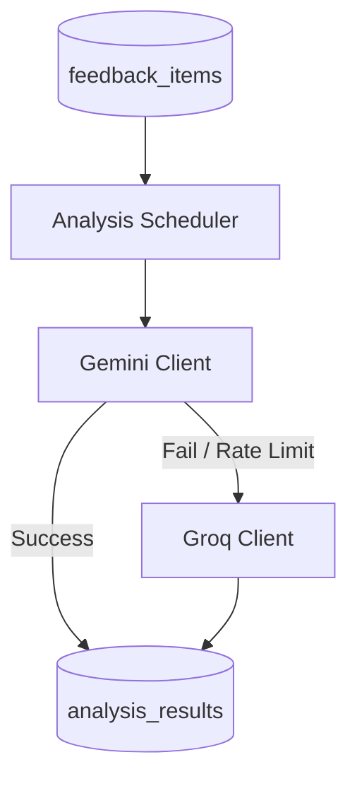

# Phase-Wise Architecture: Spotify AI-Powered Review Discovery Engine

This document defines a phased build plan for the review discovery engine. Each phase delivers a working increment that can be validated before the next phase begins.

**Data sources (fixed scope):**

1. **Primary Source**: One merged CSV file containing Spotify App Store and Play Store reviews.
2. **Secondary Sources**:
   - Product Hunt API: Posts, reviews, and comments matching the product slug **`spotify`**.
   - YouTube Data API: Video metadata and comments retrieved via keyword search queries.

**Core analysis goals:**

- Discovery struggles and recommendation frustrations
- Listening behaviors and repeated listening loops
- User segments and unmet needs
- Cross-source comparison (App Reviews vs. Product Hunt vs. YouTube comments)

---

## Phase Overview

| Phase | Name | Primary Focus | Depends On |
|-------|------|---------------|------------|
| 0 | Foundation & Infrastructure | Project scaffold, storage, Gemini/Groq API client stubs, DB schema | — |
| 1 | Data Ingestion | CSV parser, Product Hunt connector (slug-based), YouTube connector (keyword-based) | Phase 0 |
| 2 | Preprocessing & Normalization | Unified schema, cleaning, deduplication, platform tagging | Phase 1 |
| 3 | Query & Filter Layer | Multi-source search, ratings/dates/platform filters, aggregations | Phase 2 |
| 4 | AI Analysis Engine | Gemini (primary) & Groq (fallback) categorization, theme detection, loop analysis | Phase 2, Phase 3 |
| 5 | Insight Dashboard | Explorer UI, comparison widgets, source badges, evidence snippets | Phase 3, Phase 4 |
| 6 | Integration & PM Outputs | Exports (JSON/CSV), runbooks, validation, E2E tests | All prior phases |

---

## Phase 0: Foundation & Infrastructure

### Objectives

- Establish project structure, environment configuration, and database connection.
- Define DB schemas for raw tables, unified feedback table, and LLM analysis results.
- Set up API client stubs for Gemini and Groq.

### Technical Modules

| Module | Responsibility |
|--------|----------------|
| **Config & Secrets** | Load variables: `GEMINI_API_KEY`, `GROQ_API_KEY`, `PRODUCT_HUNT_ACCESS_TOKEN`, `PRODUCT_HUNT_SLUG`, `YOUTUBE_API_KEY`, `DATABASE_URL` |
| **Database Layer** | SQLite (development) and PostgreSQL (production capability) schemas, migrations, connection pools |
| **Backend API Shell** | FastAPI framework with routers for ingestion, queries, analysis, and dashboard endpoints |
| **AI Client Layer** | SDK initialization wrapper for Gemini (primary) and Groq (fallback/support) |

### Database Schema Draft (`Base.metadata`)

- **`raw_reviews`**: Fields matching the primary app reviews CSV schema.
- **`raw_producthunt_posts`** & **`raw_producthunt_comments`**: Fields to cache ingested raw Product Hunt data.
- **`raw_youtube_videos`** & **`raw_youtube_comments`**: Fields to cache YouTube video metadata and comments.
- **`feedback_items`**: The unified, normalized target table containing index structures for high-performance filters.
- **`analysis_results`**: Table to map AI-generated themes, loop causes, segments, and needs to specific feedback items.

---

## Phase 1: Data Ingestion

### Objectives

- Load raw review CSV rows into the primary database.
- Connect to the Product Hunt API using GraphQL/REST to ingest data for slug `spotify`.
- Connect to the YouTube Data API to perform keyword searches and fetch matching videos and comments.
- Prevent duplicate raw ingestion using unique IDs (`review_id`, `producthunt_post_id`/`comment_id`, `youtube_video_id`/`comment_id`).

### Technical Modules

| Module | Responsibility |
|--------|----------------|
| **CSV Ingestor** | Bulk parse and validate App/Play Store reviews CSV |
| **Product Hunt Connector** | API client query using `PRODUCT_HUNT_SLUG=spotify` to fetch posts and comments |
| **YouTube Connector** | Search API execution to retrieve metadata and comment threads for configured query terms |
| **Ingestion Status API** | Endpoint to report rows read, inserted, skipped, and errors by source |

### Ingestion Data Flow

---

## Phase 2: Preprocessing & Normalization

### Objectives

- Transform raw source tables into a single unified `feedback_items` database.
- Normalize whitespaces, sanitize markup, and standardize dates and ratings.
- Handle fallback values for missing metadata.

### Unified Schema (`feedback_items`)

| Field | Type | Description |
|-------|------|-------------|
| `id` | String(36) | Primary Key (UUID) |
| `source_type` | String(32) | `app_review`, `product_hunt_post`, `product_hunt_comment`, `youtube_video`, `youtube_comment` |
| `platform` | String(32) | `app_store`, `play_store`, `product_hunt`, `youtube` |
| `text` | Text | Primary body content (normalized whitespace, HTML stripped) |
| `title` | String(512) | Title of the review or post (nullable) |
| `rating_or_score` | Float | Star rating (1.0-5.0) or engagement score (e.g. votes/likes) |
| `author` | String(256) | User handle (anonymized where appropriate) |
| `created_at` | DateTime | Standardized timestamp |
| `app_version` | String(64) | Optional version identifier (App Reviews only) |
| `url` | String(1024) | URL link to the original review, post, or video |
| `raw_id` | String(36) | Reference ID of the source record |
| `product_hunt_slug` | String(128) | Configured product slug (Product Hunt only) |
| `youtube_search_query` | String(256) | Searched keywords (YouTube only) |
| `youtube_video_id` | String(64) | Associated video ID (YouTube only) |
| `product_hunt_post_id` | String(64) | Associated post ID (Product Hunt comments only) |

---

## Phase 3: Query & Filter Layer

### Objectives

- Enable performant, structured filtering across all four ingestion platforms.
- Ensure deterministic paginated results (using fallbacks like item ID sorting).
- Implement cross-source keyword and case-insensitive text search.

### API Endpoints

- `GET /feedback`: Queries feedback items.
  - Parameters: `limit`, `offset`, `platform` (app_store, play_store, product_hunt, youtube), `rating_min`, `rating_max`, `start_date`, `end_date`, `q` (search query), `sort_by`, `sort_order`.
- `GET /stats/overview`: Returns multi-source summaries (count distributions by platform and date).

---

## Phase 4: AI Analysis Engine

### Objectives

- Analyze feedback body text using Large Language Models (LLMs).
- Identify music discovery struggles, algorithm complaints, listening behaviors, loop triggers, segments, and unmet needs.
- Cite specific feedback snippet IDs for validation.

### LLM Implementation Strategy

- **Primary Driver**: **Gemini** (using `GEMINI_API_KEY`). Leverages structured JSON output modes (structured schema parsing) for high-accuracy categorization.
- **Fallback / Support**: **Groq** (using `GROQ_API_KEY`). Serves as a backup provider if rate limits are hit or for quick/light preprocessing runs.
- *OpenAI and Anthropic APIs are excluded.*

---

## Phase 5: Insight Dashboard

### Objectives

- Provide a single-page explorer UI.
- Support filters for all four source platforms with custom UI badges.
- Render side-by-side volume, rating, and AI insight comparisons across App Reviews, Product Hunt, and YouTube.

### UI Badges and Cards

- **App Reviews (App Store & Play Store)**: Show star ratings, version info, and device platforms.
- **Product Hunt**: Show vote counts and user feedback thread slugs.
- **YouTube**: Show video reference titles, comment like metrics, and video URLs.

---

## Phase 6: Integration, Validation & PM Outputs

### Objectives

- Finalize end-to-end data pipelines.
- Generate structured exports and automated markdown reports.
- Validate robustness with integration test cases.

### Outputs & Observability
- **PM Exports**: JSON/CSV schema exports containing the unified feedback fields and AI analysis tags.
- **Limitations Tracking**: Log YouTube API quota consumption (monitoring Search vs. Comment API costs) and Product Hunt GraphQL rate metrics.

---

## Recommended Tech Stack

| Component | Technology | Rationale |
|-----------|------------|-----------|
| **Backend** | Python + FastAPI / Streamlit | Fast performance, API routing, native Python DB/LLM wrappers. Deployed on Streamlit Sharing. |
| **Database** | SQLite &rarr; PostgreSQL | SQLite for local development/testing; Cloud PostgreSQL (e.g. Supabase/Neon) for production persistence. |
| **Primary LLM** | Gemini API | Cost-effective, large context windows, native structured output support. |
| **Fallback LLM** | Groq API | Ultra-low latency fallback processing. |
| **API Clients** | Google APIs Client + Product Hunt GraphQL client | Official SDKs for YouTube Data API v3 and Product Hunt GraphQL v2. |
| **Frontend** | Next.js (TypeScript, React) | Modern React framework with dynamic routing and server/client-side optimization. Deployed on Vercel. |

---

## Concluding Note: Ingestion Retrieval Patterns
- **Product Hunt**: Operates strictly on a **slug-based lookup** pattern using the configured slug (defaulting to **`spotify`**) to retrieve the targeted product post, reviews, and comment threads.
- **YouTube**: Operates on a **keyword-based search** pattern, running search queries across the global database of videos to match topics, and then extracting comment threads for those videos. YouTube does not utilize a slug lookup.
